# Neuro-Symbolic Safe Driving

A neural network learns to drive and overtake on a busy highway. Real traffic law, taken from a
published paper and written as logic, is then added on top to make the car safe, and to **measure**
and **explain** how safe it is.

<p align="center">
  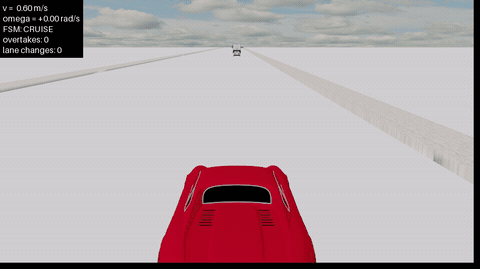<br>
  <sub>The final driver (MCTS planner + rule shield) in MetaDrive, a 3-D world it never trained in.</sub>
</p>

| Part | Question | Answer |
|---|---|---|
| **1. Learn to drive** | Which RL algorithm drives best? | **QR-DQN**: 78% crashes (DQN and PPO: 100%), and it drives the furthest |
| **2. Apply the rules** | Which way of adding rules works best? | **Shield + reward**: fewest violations (0.97 vs 1.80). The shield alone cuts crashes 78% → 12% |
| **3. A new world** | Do the rules still work in another simulator? | **Yes**: crashes 35% → 5%, and **MCTS + shield** stays safe *and* keeps overtaking |

Every violation is counted by an **independent checker**, never by the reward or the shield the car
uses. **Slides:** [`paper/presentation/nesy_presentation.pdf`](paper/presentation/nesy_presentation.pdf).

---

## The idea

**Neuro-Symbolic AI** joins a **neural network** (learns by itself, fast, but a black box) with
**symbolic rules** (written by humans, clear and checkable). The network drives; the rules check it
and explain each decision. Three ways of adding the rules are compared:

- **Shield**: block an unsafe move at the last moment. Safe with no re-training, but cautious.
- **Reward shaping**: teach the rules during training. Keeps performance, but no guarantee.
- **Planning (MCTS)**: look a few steps ahead and prefer legal moves. No training at all.

## The rules

The rules come from **Maierhofer et al., *Formalization of Interstate Traffic Rules in Temporal Logic*,
IEEE IV 2020** ([PDF](paper/Formalization_of_Interstate_Traffic_Rules_in_Temporal_Logic.pdf)). The
paper turns German traffic law and court rulings into **metric temporal logic** (logic with time:
*always*, *eventually*, …), so a program can check every rule. On 2,500+ real German drivers, only
37% obeyed every rule; safe distance and speed limit were the most broken.

| Rule | Meaning | Kind | Used by |
|---|---|---|---|
| RG1 | keep a safe distance from the car ahead | **hard** | shield (veto) |
| RG3 | do not go over the speed limit | **hard** | shield (veto) |
| RI1 | do not stop in the middle of the road | **hard** | shield (veto) |
| RG2 | do not brake harshly for no reason | soft | reward (penalty) |
| RG4 | do not block the traffic behind you | soft | reward (penalty) |
| RI2 | do not overtake on the right | soft | reward (penalty) |

Hard rules can directly cause a crash, so they are forbidden; soft rules are bad habits, so they are
penalised (this split is the project's choice, not the paper's). RG1 uses the paper's safe distance
$d_{\text{safe}} = v\,t_d + \frac{v^2}{2|a_{\text{ego}}|} - \frac{v_{\text{lead}}^2}{2|a_{\text{lead}}|}$
with $t_d = 0.3$ s. All thresholds live in [`configs/highway.yaml`](configs/highway.yaml). The
follow-up paper on **intersection** rules (IEEE IV 2022,
[PDF](paper/Formalization_of_Intersection_Traffic_Rules_in_Temporal_Logic.pdf)) is future work.

---

## Part 1: Learn to drive

[highway-env](https://github.com/Farama-Foundation/HighwayEnv): 4 lanes, 50 cars, 40-second runs. The
car sees itself and the 4 nearest cars, picks one of 5 moves twice a second, and is rewarded for speed
and overtakes (aggressive on purpose). **DQN**, **QR-DQN** (DQN's twin that learns the whole range of
outcomes) and **PPO** get the same 20k training steps and the same 50 test runs.

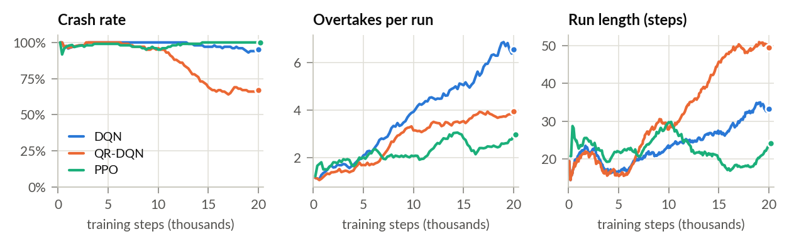
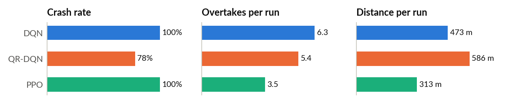

DQN passes the most cars but always crashes: the best *average* is to drive flat out. **QR-DQN** is the
only one that learns to avoid the rare crash, so it survives longest and wins.

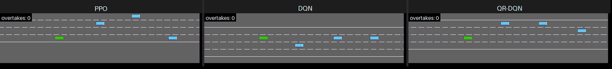

---

## Part 2: Apply the rules

The scene is turned into **true/false facts** ("too close?", "passing on the right?"). The same facts
feed the shield, the reward, MCTS and the checker. Six setups are tested on QR-DQN:

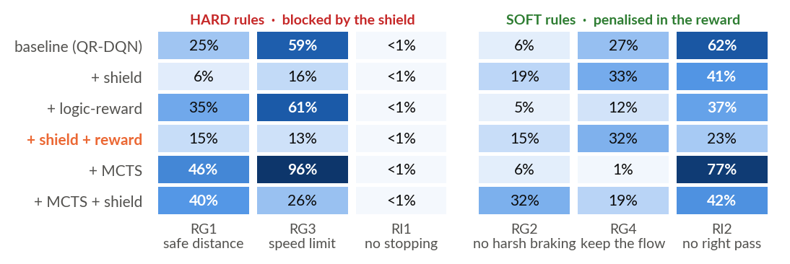

The **shield** fixes the hard rules, the **reward** fixes the soft ones, so **shield + reward** has the
fewest violations. A setup is *allowed* if it crashes no more than the baseline and keeps at least half
its overtakes:

<p align="center">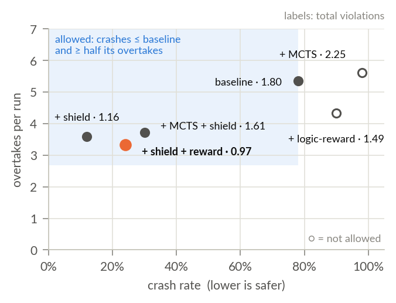</p>

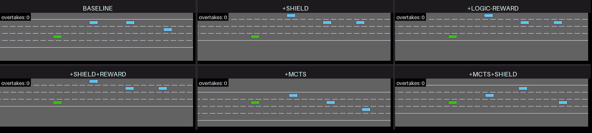

---

## Part 3: A new world

The frozen QR-DQN drives a robot car in [MetaDrive](https://github.com/metadriverse/metadrive) (3-D
physics, 3 lanes, robot-scale speeds), through the course labs:

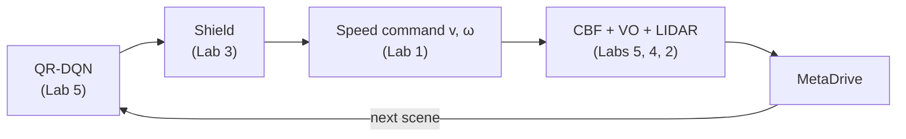

| brain only | + shield | MCTS + shield |
|:---:|:---:|:---:|
| 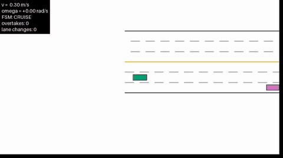 | 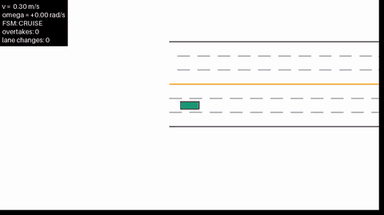 |  |
| **35%** crashes, 2.15 passes | **5%** crashes, 1.40 passes | **5%** crashes, **2.15** passes |

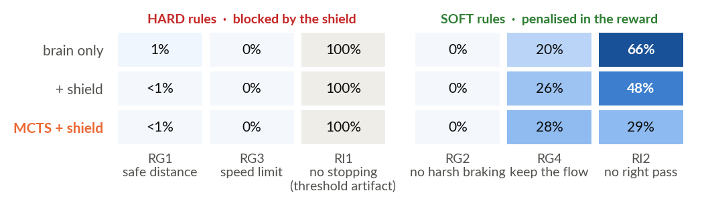

The CBF keeps the hard rules at ≈0. **MCTS** wins: it plans on the real scene and uses the rules
*before* acting, so it stays safe and still overtakes. RI1 is a threshold artifact ("stopped" = below
18 m/s, but the robot drives at ≈8 m/s). The same safe-distance rule, written as a logic fact, a
blocked move and a CBF barrier, always agrees (`rule_encoding_agreement` in
[`nesy/roadmap.py`](nesy/roadmap.py)).

---

## Why are some hard rules still broken with the shield?

<p align="center">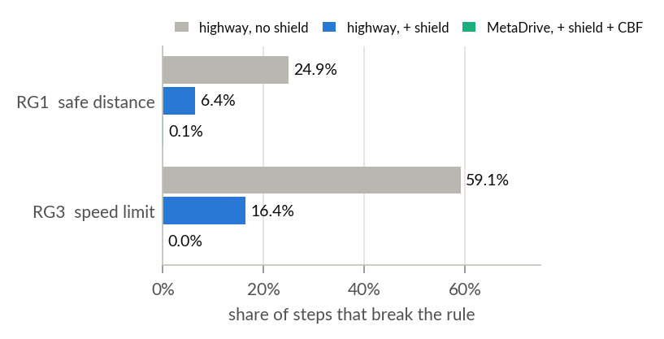</p>

The highway shield cuts the hard rules a lot, but not to zero. A replay of the same 50 test runs
(matching the saved results exactly) shows the cause of every violating step:

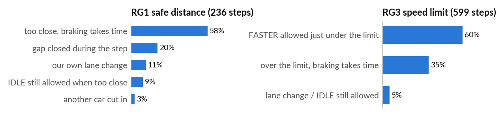

- **It acts only after the fact.** It brakes once the rule is already broken, and speed changes
  gradually (≈0.6 s), so the gap needs time to reopen (58% of RG1). 5 of the 6 crashes: ran into the
  car ahead.
- **It checks now, not next.** Below 25 m/s `FASTER` is allowed, but it sets the target to 30 m/s and
  the car overshoots (60% of RG3). Gaps also close during a step it allowed (20% of RG1).
- **Small gaps in the mask.** `IDLE` stays allowed when too close, and lane changes when over the limit.
  Cut-ins by other cars are only 3%.

The fix is a **predictive** shield that checks the state *after* the move. The CBF in MetaDrive already
works this way on the continuous speed, and brings both rules to ≈0.

---

## What we learned

- A reward alone is not enough: the network drives fast but crashes.
- A **shield** makes it safe with no re-training; a **shaped reward** teaches habits; together they fix
  different rules.
- **MCTS + shield** was safe and overtaking in a world it never trained on.
- The same rules worked in two simulators, checked by an independent monitor.

**Limits:** short training (20k steps), small tests (50 highway runs, 20 MetaDrive runs), highway
thresholds on a slow robot. **Next:** add the 2022 intersection rules and switch rule sets with the
environment.

---

## How to run

Open a notebook in Google Colab and choose **Runtime → Run all**, in order:
[`colab_1_baseline`](notebooks/colab_1_baseline.ipynb) →
[`colab_2_nesy`](notebooks/colab_2_nesy.ipynb) →
[`colab_3_metadrive`](notebooks/colab_3_metadrive.ipynb). Each part saves its result to Google Drive for
the next. Paste a GitHub token when asked (private repo). Part 3 installs Python 3.10 and restarts
once; choose **Run all** again. The 3-D video needs a local machine with a display.

**Slides and charts:**

```bash
cd paper/presentation && python make_figures.py && latexmk -pdf nesy_presentation.tex
```

## Project structure

```
nesy-highway-driving/
├── configs/highway.yaml   # all settings and rule thresholds
├── notebooks/             # the three Colab notebooks (the only place code runs)
├── envs/                  # the two simulators + scene reading
├── agents/baselines.py    # train and load the RL agents
├── nesy/roadmap.py        # the rules: predicates, shield, independent checker
├── labs/                  # course labs: speed command, LIDAR, FSM shield, MCTS + VO, CBF
├── eval/                  # evaluation + plots
├── demo/                  # scripts that record the videos
├── tests/                 # smoke tests
└── paper/                 # the two traffic-rule papers
    └── presentation/      # slides (.tex/.pdf), make_figures.py, data/, figures/, videos/
```
